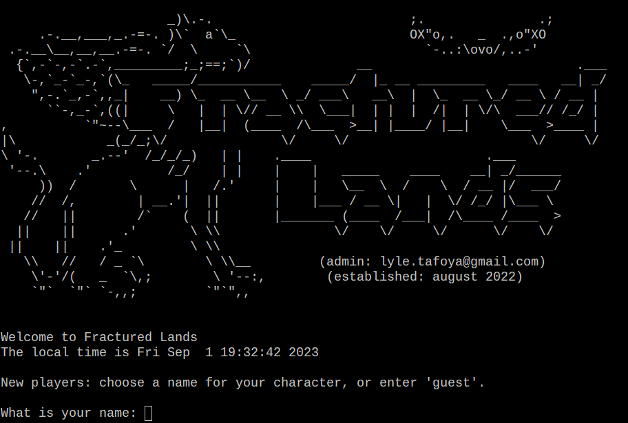

# Fractured-Lands

A C++ MUD server inspired by the classic 1990 MUD "Shattered World"

# Build Instructions

Fractured Lands relies on epoll, and as such, can only be built on Linux

    mkdir Fractured-Lands/build
    cd Fractured-Lands/build
    cmake .. -DCMAKE_BUILD_TYPE=Release
    make

When you run Fractured Lands, the active directory must be the project root, as this is necessary for it to find various files such as welcome.txt

Fractured Lands expects to find a mongodb instance at mongodb://localhost:27017
